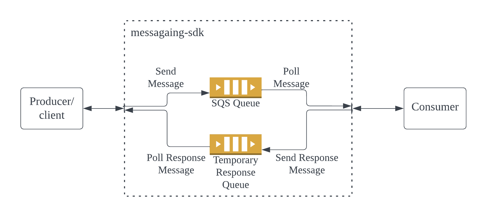

# messaging-sdk

SDK that can be used for message driven services with request-reply pattern.

Usage

### Dependency
```xml
<dependency>
    <groupId>vinay</groupId>
    <artifactId>messaging-sdk</artifactId>
    <version>0.0.1</version>
</dependency>
```

### SQS 

Working with SQS Temporary Queue



Application Config usage

```yaml
messaging:
  channel: SQS
  defaultReceiveTimeout: 10 # wait timeperiod for the response. default is 10 seconds.
  awsRegion: "us-east-1" # default is us-east-1
  awsConnectTimeout: 60 # default is 60 seconds
  awsSocketTimeout: 60 # default is 60 seconds
  maxConnectionsInPool: 5 # Max connections in the pool to be reused. default is 5
  sqsQueues:
    sample1: # Channel name <Required>
      prefix: "sample-standard" # queue prefix <Required>
      dlqArn: "arn:aws:sqs:us-east-1:${AWS_ACCOUNT_ID}:sample-standard_DLQ" # <Required>
      queueUrl: "https://sqs.us-east-1.amazonaws.com/${AWS_ACCOUNT_ID}/sample-standard" # <Required>
      sendMessage: true # if service is a producer/client then set it as true to send message to SQS. default is false
      respondMessage: false # if service is a consumer then set it as true to poll and consume message to SQS. default is false
      pollingThreadCount: 5 # Number of threads to be used for polling messages parallely. default is 5
      idleQueueSweepingPeriod: 300 # Idle queue sweeping period for temporary queues in seconds. default is 300
      idleQueueRetentionPeriod: 300 # Idle queue retention period of temporary queues in seconds. default is 300
      queueHeartBeatInterval: 360 # to check if queue is idle for temporary queue in seconds. default is 360
      maxReceiveCount: 1 # Number of times message can be received by consumer incase of failure. default is 1.
    sample2:
      prefix: "sample-standard1"
      dlqArn: "arn:aws:sqs:us-east-1:${AWS_ACCOUNT_ID}:sample-standard_DLQ" 
      queueUrl: "https://sqs.us-east-1.amazonaws.com/${AWS_ACCOUNT_ID}/sample-standard"
      sendMessage: true
      respondMessage: false
```

Usage sample for Client to sendAndReceiveMessage

```java
import jakarta.annotation.Resource;
import org.springframework.stereotype.Component;
import org.springframework.stereotype.Service;
import vinay.messagingsdk.MessagingService;
import vinay.messagingsdk.dto.MessageBody;
import vinay.messagingsdk.dto.MessageRequest;
import vinay.messagingsdk.dto.MessageResponse;
import vinay.messagingsdk.impl.MessagingServiceBean;

import java.util.HashMap;

@Service
public class Sample {

    @Resource
    MessagingServiceBean messagingService;

    public void test() {
        MessageBody messageBody = new MessageBody("operationName",
                "request", //Actual message as String
                "correlationId",
                "idempotencyKey");
        MessageRequest messageRequest = MessageRequest.builder()
                .channelName("sample1") // channel name to use the configs from application config
                .messageBody(messageBody) // MessageBody
                .messageAttributes(new HashMap<>()) // to add any message attributes
                .delayMessageInSeconds(0) // delay time in seconds to delay the message delivery to consumer
                .timeout(10) // Timeperiod to wait for the response
                .build();
        MessageResponse messageResponse = this.messagingService
                .sendAndReceiveMessage(messageRequest).messageBody();
    }
}
```

Usage sample for Consumer to consume and respond Message

```java
import org.springframework.stereotype.Service;
import software.amazon.awssdk.services.sqs.model.Message;
import vinay.messagingsdk.channel.SQSRespondingService;
import vinay.messagingsdk.dto.MessageBody;
import vinay.messagingsdk.dto.MessageResponse;

@Service("Sample1RespondingService")
// Service name should be defined as <channel name as in application config> + "RespondingService"
public class Sample implements SQSRespondingService { // implemet SQSRespondingService

    @Override
    public MessageResponse respondMessage(Message message, MessageBody messageBody ) { // request messageBody
        return new MessageResponse(true, new MessageBody(messageBody.operationName(),
                "response message",// response message
                messageBody.correlationId(), messageBody.idempotencyKey()));;
    }
}
```

Sample Ref implementation : https://github.com/vinayputtaraju/client-consumer
